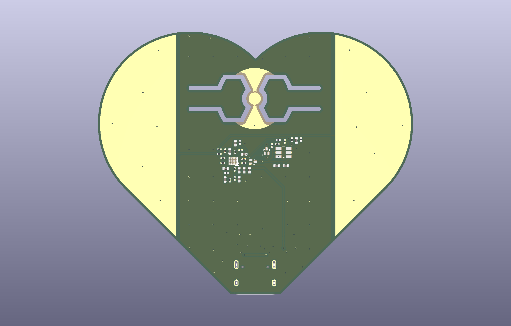
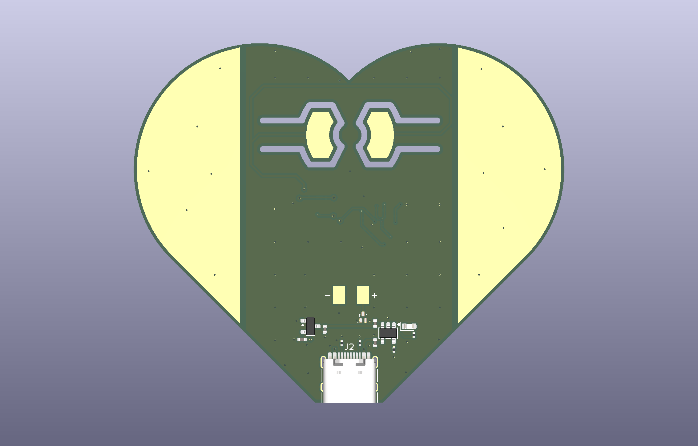
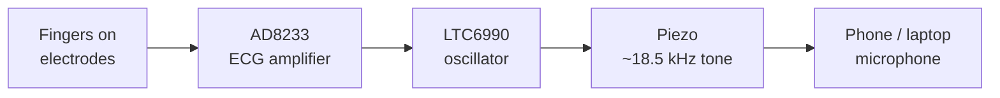
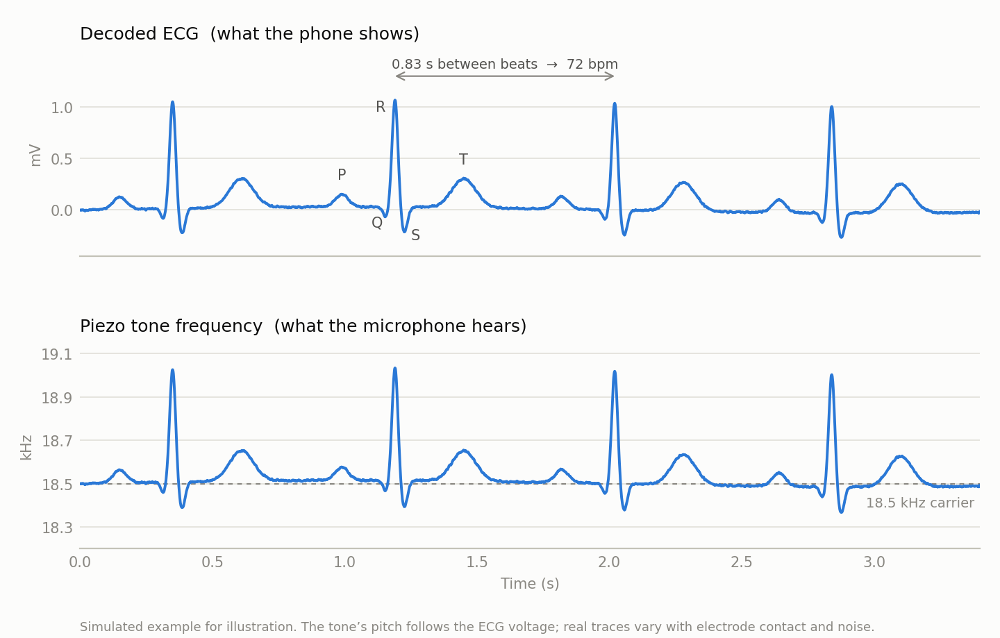

# Heartthrob

A heart-shaped ECG board that turns your heartbeat into sound. Touch the two gold electrodes and it plays your ECG as a high-pitched tone, which a phone or laptop can decode using its microphone. It has no Bluetooth, no Wi-Fi and no firmware.

  
  

## How it works

1. **Pick up the signal.** One finger from each hand rests on the gold electrodes on each side of the heart. The tiny voltage your heart produces appears between them.
2. **Amplify it.** An AD8233 ECG chip amplifies and filters that signal into a clean waveform.
3. **Turn it into a tone.** The waveform controls an LTC6990 oscillator, so the pitch of an 18.5 kHz tone rises and falls with each heartbeat.
4. **Play it.** A small piezo plays the tone. It is high enough that most adults can't hear it, but phone microphones can.
5. **Decode it.** A phone or laptop listens to the tone, tracks its pitch, and turns it back into a live ECG trace and heart rate.

  <picture>
    <source media="(prefers-color-scheme: dark)" srcset="hardware/Heartthrob/illustrations/sample-waveform-dark.png">
    
  </picture>

The top trace is what the phone shows: P, QRS and T waves for each beat, with heart rate taken from the time between R peaks. The bottom trace is the same signal as the microphone hears it: a tone near 18.5 kHz whose pitch rises and falls with the ECG. (Simulated example.)

When nobody is touching the electrodes, the board detects that the leads are off and switches the oscillator off to save battery. 

## Power

The board runs on a small 1S LiPo battery soldered to pads on the back, and charges over USB-C. A 3.0 V regulator powers the circuit, and a P-FET protects it if the battery is connected backwards.

## Project structure

- `hardware/Heartthrob/`
  KiCad 10 project: schematic, 4-layer PCB layout, design rules and custom footprints. Open `Heartthrob.kicad_pro`.
- `hardware/Heartthrob/Render/`
  3D renders of the front and back.
- `hardware/Heartthrob/Documentation/`
  Schematic PDF, per-layer PCB plots, and earlier design snapshots in `Archive/`.
- `hardware/Heartthrob/illustrations/`
  Figures used in this README.

> **Note:** This is a hobby project, not a medical device. Don't use it for diagnosis, and don't wear it while it's plugged in to charge.

## Credits

Based on [SiBowald's ECG PCB business card](https://github.com/SiBowald/ecg-pcb-business-card), redesigned by Kevin Su as a rechargeable, heart-shaped board. 
